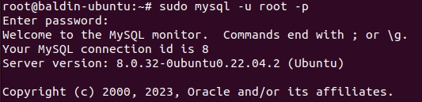
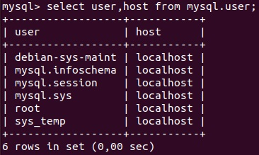
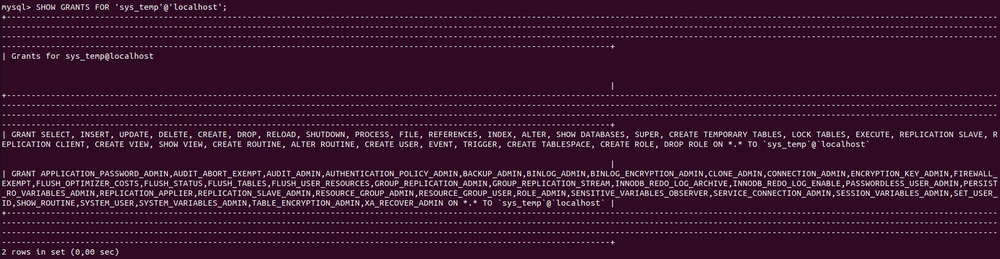
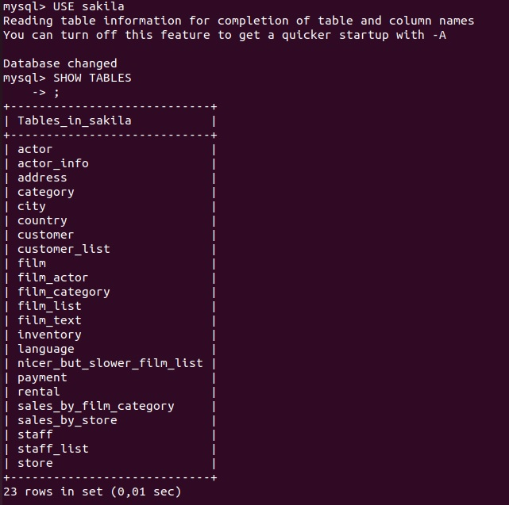
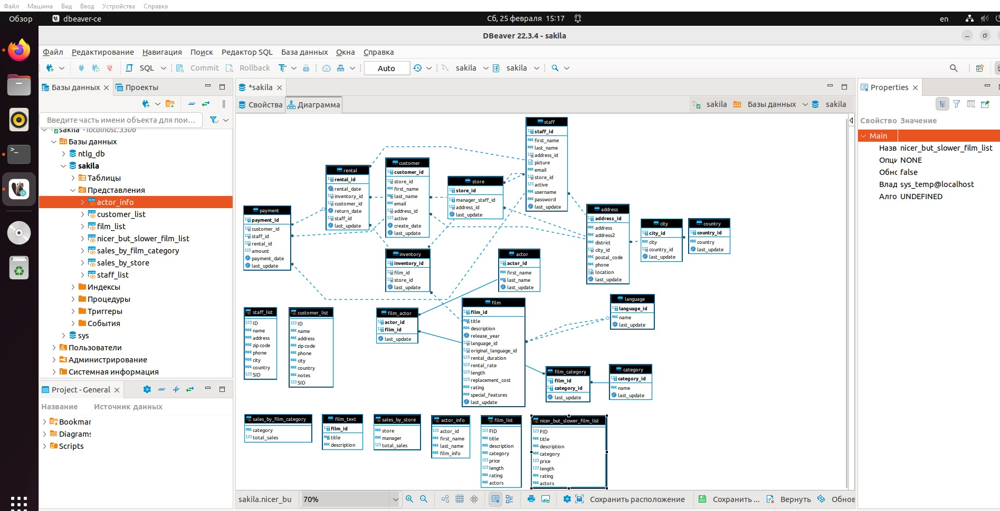

# Домашнее задание к занятию 12.2. «Работа с данными (DDL/DML)» - Балдин Алексей

Задание можно выполнить как в любом IDE, так и в командной строке.

### Задание 1
1.1. Поднимите чистый инстанс MySQL версии 8.0+. Можно использовать локальный сервер или контейнер Docker.



1.2. Создайте учётную запись sys_temp. 

1.3. Выполните запрос на получение списка пользователей в базе данных.

#### Скриншот прилагаю:



1.4. Дайте все права для пользователя sys_temp. 

1.5. Выполните запрос на получение списка прав для пользователя sys_temp.

#### Скриншот прилагаю:



1.6. Переподключитесь к базе данных от имени sys_temp.

Для смены типа аутентификации с sha2 используйте запрос: 
```sql
ALTER USER 'sys_test'@'localhost' IDENTIFIED WITH mysql_native_password BY 'password';
```
1.6. По ссылке https://downloads.mysql.com/docs/sakila-db.zip скачайте дамп базы данных.

1.7. Восстановите дамп в базу данных.

1.8. При работе в IDE сформируйте ER-диаграмму получившейся базы данных. При работе в командной строке используйте команду для получения всех таблиц базы данных. 

#### Скриншоты прилагаю:





----

### Задание 2
Составьте таблицу, используя любой текстовый редактор или Excel, в которой должно быть два столбца: в первом должны быть названия таблиц восстановленной базы, во втором названия первичных ключей этих таблиц. 

### Решение:

| Название таблицы | Название первичного ключа |
| ----------- |:-------------:|
| customer | customer_id |
| rental | rental_id |
| payment | payment_id |
| store | store_id |
| inventory | inventory_id |
| actor | actor_id |
| film | film_id |
| film_actor | film_id, actor_id |
| staff | staff_id |
| address | address_id |
| city | city_id |
| country | country_id |
| language | language_id |
| film_category | film_id, category_id |
| category | category_id |
| staff_list | |
| customer_list | |
| sales_by_film_category | |
| film_text | |
| sales_by_store | |
| actor_info | |
| film_list | |
| nicer_but_slower_film_list | |
